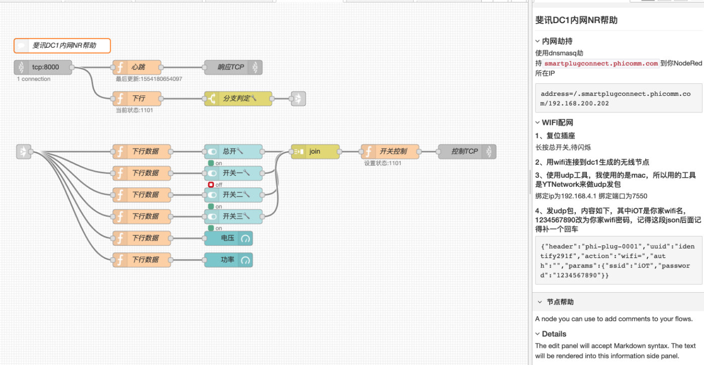

# 控制斐讯DC1插座

作者：[flashsoft](https://gist.github.com/FlashSoft/ad58fb711f89ea7cac95ae4d8450456f)




## 依赖节点

```
node-red-dashboard
```

## 使用说明

* 内网劫持  
使用dnsmasq劫持smartplugconnect.phicomm.com到你NodeRed所在IP
```
address=/.smartplugconnect.phicomm.com/192.168.200.202
```

* WiFi 配置  
使用原app配置或第三方软件配置


## Node Red  流程

```
[
    {
        "id": "966d4a60.9dcaa8",
        "type": "tcp in",
        "z": "f5965567.2c44c8",
        "name": "",
        "server": "server",
        "host": "",
        "port": "8000",
        "datamode": "stream",
        "datatype": "buffer",
        "newline": "",
        "topic": "",
        "base64": false,
        "x": 125,
        "y": 135,
        "wires": [
            [
                "9f4e2d0c.585b2",
                "c9264cb3.eb459"
            ]
        ],
        "info": "{\"header\":\"phi-plug-0001\",\"uuid\":\"identify291f\",\"action\":\"wifi=\",\"auth\":\"\",\"params\":{\"ssid\":\"iOT\",\"password\":\"18610015552\"}}"
    },
    {
        "id": "2789535c.a4e1ec",
        "type": "tcp out",
        "z": "f5965567.2c44c8",
        "host": "",
        "port": "",
        "beserver": "reply",
        "base64": false,
        "end": false,
        "name": "响应TCP",
        "x": 520,
        "y": 135,
        "wires": []
    },
    {
        "id": "9f4e2d0c.585b2",
        "type": "function",
        "z": "f5965567.2c44c8",
        "name": "心跳",
        "func": "const json = JSON.parse(msg.payload)\n\nlet uuid = ''\nconst is_first = json.action == 'activate='\nconst is_heart = json.msg == 'get datapoint success'\n\n// 如果是设备来注册\nif (json.action == 'activate=') {uuid = json.params.mac}\n// 如果是自己构造的uuid\nelse{uuid = json.uuid}\n\n// 如果请求类型是设备心跳或是设备激活\n// 并且是一个有效的uuid\nif((is_heart || is_first) && uuid.length == 17) {\n  node.status({text:`最后更新:${new Date().toLocaleTimeString('zh-cn',{timeZone: \"Asia/Chongqing\"})}`})\n  // node.warn(JSON.stringify(json))\n  msg.payload = `{\"action\":\"datapoint\",\"params\":{},\"uuid\":\"${uuid}\",\"auth\":\"\"}\\n`\n  \n  // 通过定时器清理解决同一个请求被多次发出问题\n  clearTimeout(flow.get(`TIMER_${uuid}`))\n  // 延迟一秒发出\n  const timer = setTimeout(() => node.send(msg), 1000)\n  flow.set(`TIMER_${uuid}`, timer)\n}",
        "outputs": 1,
        "noerr": 0,
        "x": 320,
        "y": 135,
        "wires": [
            [
                "2789535c.a4e1ec"
            ]
        ]
    },
    {
        "id": "4270793b.ca6ba8",
        "type": "ui_switch",
        "z": "f5965567.2c44c8",
        "name": "",
        "label": "总开关",
        "tooltip": "",
        "group": "71feefc.6b0a31",
        "order": 1,
        "width": "0",
        "height": "0",
        "passthru": true,
        "decouple": "false",
        "topic": "B4:E6:2D:35:6B:94_0",
        "style": "",
        "onvalue": "true",
        "onvalueType": "bool",
        "onicon": "",
        "oncolor": "",
        "offvalue": "false",
        "offvalueType": "bool",
        "officon": "",
        "offcolor": "",
        "x": 510,
        "y": 310,
        "wires": [
            [
                "ecb0ab07.f4d7f8"
            ]
        ]
    },
    {
        "id": "1d9b8371.2c5c4d",
        "type": "comment",
        "z": "f5965567.2c44c8",
        "name": "斐讯DC1内网NR帮助",
        "info": "### 内网劫持\n\n使用dnsmasq劫持`smartplugconnect.phicomm.com`到你NodeRed所在IP\n\n```\naddress=/.smartplugconnect.phicomm.com/192.168.200.202\n```\n\n### WIFI配网\n\n#### 1、复位插座\n\n长按总开关,待闪烁\n\n#### 2、用wifi连接到dc1生成的无线节点\n\n#### 3、使用udp工具，我使用的是mac，所以用的工具是YTNetwork来做udp发包\n\n绑定ip为192.168.4.1\n绑定端口为7550\n\n#### 4、发udp包，内容如下，其中iOT是你家wifi名，1234567890改为你家wifi密码，记得这段json后面记得补一个回车\n```\n{\"header\":\"phi-plug-0001\",\"uuid\":\"identify291f\",\"action\":\"wifi=\",\"auth\":\"\",\"params\":{\"ssid\":\"iOT\",\"password\":\"1234567890\"}}\n```",
        "x": 165,
        "y": 90,
        "wires": []
    },
    {
        "id": "5ed07bf9.61abf4",
        "type": "ui_switch",
        "z": "f5965567.2c44c8",
        "name": "",
        "label": "开关一",
        "tooltip": "",
        "group": "71feefc.6b0a31",
        "order": 2,
        "width": "0",
        "height": "0",
        "passthru": true,
        "decouple": "false",
        "topic": "B4:E6:2D:35:6B:94_1",
        "style": "",
        "onvalue": "true",
        "onvalueType": "bool",
        "onicon": "",
        "oncolor": "",
        "offvalue": "false",
        "offvalueType": "bool",
        "officon": "",
        "offcolor": "",
        "x": 510,
        "y": 355,
        "wires": [
            [
                "ecb0ab07.f4d7f8"
            ]
        ]
    },
    {
        "id": "614f4633.56ac38",
        "type": "ui_switch",
        "z": "f5965567.2c44c8",
        "name": "",
        "label": "开关二",
        "tooltip": "",
        "group": "71feefc.6b0a31",
        "order": 3,
        "width": "0",
        "height": "0",
        "passthru": true,
        "decouple": "false",
        "topic": "B4:E6:2D:35:6B:94_2",
        "style": "",
        "onvalue": "true",
        "onvalueType": "bool",
        "onicon": "",
        "oncolor": "",
        "offvalue": "false",
        "offvalueType": "bool",
        "officon": "",
        "offcolor": "",
        "x": 510,
        "y": 400,
        "wires": [
            [
                "ecb0ab07.f4d7f8"
            ]
        ]
    },
    {
        "id": "1809ce50.15ced2",
        "type": "ui_switch",
        "z": "f5965567.2c44c8",
        "name": "",
        "label": "开关三",
        "tooltip": "",
        "group": "71feefc.6b0a31",
        "order": 4,
        "width": "0",
        "height": "0",
        "passthru": true,
        "decouple": "false",
        "topic": "B4:E6:2D:35:6B:94_3",
        "style": "",
        "onvalue": "true",
        "onvalueType": "bool",
        "onicon": "",
        "oncolor": "",
        "offvalue": "false",
        "offvalueType": "bool",
        "officon": "",
        "offcolor": "",
        "x": 510,
        "y": 445,
        "wires": [
            [
                "ecb0ab07.f4d7f8"
            ]
        ]
    },
    {
        "id": "6062c440.dd107c",
        "type": "ui_gauge",
        "z": "f5965567.2c44c8",
        "name": "",
        "group": "71feefc.6b0a31",
        "order": 6,
        "width": "3",
        "height": "2",
        "gtype": "gage",
        "title": "电压",
        "label": "V",
        "format": "{{value}}",
        "min": "100",
        "max": "300",
        "colors": [
            "#00b500",
            "#e6e600",
            "#ca3838"
        ],
        "seg1": "",
        "seg2": "",
        "x": 510,
        "y": 490,
        "wires": []
    },
    {
        "id": "3ac793a5.66e19c",
        "type": "switch",
        "z": "f5965567.2c44c8",
        "name": "分支判定",
        "property": "uuid",
        "propertyType": "msg",
        "rules": [
            {
                "t": "eq",
                "v": "B4:E6:2D:35:6B:94",
                "vt": "str"
            },
            {
                "t": "eq",
                "v": "84:F3:EB:56:2D:5D",
                "vt": "str"
            },
            {
                "t": "else"
            }
        ],
        "checkall": "true",
        "repair": false,
        "outputs": 3,
        "x": 520,
        "y": 200,
        "wires": [
            [
                "2818f13.9c3910e"
            ],
            [
                "c9310a10.e58658"
            ],
            [
                "f891a078.fc06a"
            ]
        ]
    },
    {
        "id": "c9264cb3.eb459",
        "type": "function",
        "z": "f5965567.2c44c8",
        "name": "下行",
        "func": "const json = JSON.parse(msg.payload)\nconst is_heart = json.msg == 'get datapoint success'\n\n// 如果是心跳包\nif(is_heart) {\n  msg.payload = json\n  // 开关状态的二进制\n  msg.sw_2 = json.result.status\n  // 开关状态的十进制\n  msg.sw_10 = parseInt(msg.sw_2, 2)\n  // 设备的mac地址,利用原有uuid通道进行传递\n  msg.uuid = json.uuid\n  flow.set(`STATUS_${json.uuid}`, msg)\n  node.send(msg) \n}",
        "outputs": 1,
        "noerr": 0,
        "x": 320,
        "y": 200,
        "wires": [
            [
                "3ac793a5.66e19c"
            ]
        ]
    },
    {
        "id": "2818f13.9c3910e",
        "type": "link out",
        "z": "f5965567.2c44c8",
        "name": "斐讯DC1-书房in",
        "links": [
            "89e3d08a.b5b2"
        ],
        "x": 675,
        "y": 150,
        "wires": []
    },
    {
        "id": "89e3d08a.b5b2",
        "type": "link in",
        "z": "f5965567.2c44c8",
        "name": "斐讯DC1-书房out",
        "links": [
            "2818f13.9c3910e"
        ],
        "x": 85,
        "y": 340,
        "wires": [
            [
                "c1ff5e9a.a582a"
            ]
        ]
    },
    {
        "id": "c1ff5e9a.a582a",
        "type": "function",
        "z": "f5965567.2c44c8",
        "name": "数据分组",
        "func": "node.status({text:`当前状态:${msg.sw_2}(${msg.uuid})`})\nnode.send([\n  Object.assign({}, msg, {payload: (msg.sw_10 & 1) > 0}),\n  Object.assign({}, msg, {payload: (msg.sw_10 & 2) > 0}),\n  Object.assign({}, msg, {payload: (msg.sw_10 & 4) > 0}),\n  Object.assign({}, msg, {payload: (msg.sw_10 & 8) > 0}),\n  Object.assign({}, msg, {payload: msg.payload.result.V}),\n  Object.assign({}, msg, {payload: msg.payload.result.P}),\n])",
        "outputs": 6,
        "noerr": 0,
        "x": 220,
        "y": 340,
        "wires": [
            [
                "4270793b.ca6ba8"
            ],
            [
                "5ed07bf9.61abf4"
            ],
            [
                "614f4633.56ac38"
            ],
            [
                "1809ce50.15ced2"
            ],
            [
                "6062c440.dd107c"
            ],
            [
                "7c60a29a.50a4bc"
            ]
        ]
    },
    {
        "id": "7c60a29a.50a4bc",
        "type": "ui_gauge",
        "z": "f5965567.2c44c8",
        "name": "",
        "group": "71feefc.6b0a31",
        "order": 7,
        "width": "3",
        "height": "2",
        "gtype": "gage",
        "title": "功率",
        "label": "W",
        "format": "{{value}}",
        "min": "100",
        "max": "300",
        "colors": [
            "#00b500",
            "#e6e600",
            "#ca3838"
        ],
        "seg1": "",
        "seg2": "",
        "x": 510,
        "y": 535,
        "wires": []
    },
    {
        "id": "ecb0ab07.f4d7f8",
        "type": "join",
        "z": "f5965567.2c44c8",
        "name": "",
        "mode": "custom",
        "build": "array",
        "property": "",
        "propertyType": "full",
        "key": "topic",
        "joiner": "\\n",
        "joinerType": "str",
        "accumulate": false,
        "timeout": "0.1",
        "count": "4",
        "reduceRight": false,
        "reduceExp": "",
        "reduceInit": "",
        "reduceInitType": "num",
        "reduceFixup": "",
        "x": 710,
        "y": 310,
        "wires": [
            [
                "754ecf9b.7321e"
            ]
        ]
    },
    {
        "id": "f891a078.fc06a",
        "type": "debug",
        "z": "f5965567.2c44c8",
        "name": "",
        "active": false,
        "tosidebar": true,
        "console": false,
        "tostatus": false,
        "complete": "true",
        "targetType": "full",
        "x": 710,
        "y": 250,
        "wires": []
    },
    {
        "id": "c9310a10.e58658",
        "type": "link out",
        "z": "f5965567.2c44c8",
        "name": "斐讯DC1-客厅in",
        "links": [
            "4f20602c.99a2b"
        ],
        "x": 675,
        "y": 200,
        "wires": []
    },
    {
        "id": "c8160849.72c328",
        "type": "ui_switch",
        "z": "f5965567.2c44c8",
        "name": "",
        "label": "总开关",
        "tooltip": "",
        "group": "28f40f8c.6b654",
        "order": 1,
        "width": "0",
        "height": "0",
        "passthru": true,
        "decouple": "false",
        "topic": "84:F3:EB:56:2D:5D_0",
        "style": "",
        "onvalue": "true",
        "onvalueType": "bool",
        "onicon": "",
        "oncolor": "",
        "offvalue": "false",
        "offvalueType": "bool",
        "officon": "",
        "offcolor": "",
        "x": 510,
        "y": 600,
        "wires": [
            [
                "59af3454.dfcb0c"
            ]
        ]
    },
    {
        "id": "b56e3e24.a995b",
        "type": "ui_switch",
        "z": "f5965567.2c44c8",
        "name": "",
        "label": "开关一",
        "tooltip": "",
        "group": "28f40f8c.6b654",
        "order": 2,
        "width": "0",
        "height": "0",
        "passthru": true,
        "decouple": "false",
        "topic": "84:F3:EB:56:2D:5D_1",
        "style": "",
        "onvalue": "true",
        "onvalueType": "bool",
        "onicon": "",
        "oncolor": "",
        "offvalue": "false",
        "offvalueType": "bool",
        "officon": "",
        "offcolor": "",
        "x": 510,
        "y": 645,
        "wires": [
            [
                "59af3454.dfcb0c"
            ]
        ]
    },
    {
        "id": "d797dd56.08137",
        "type": "ui_switch",
        "z": "f5965567.2c44c8",
        "name": "",
        "label": "开关二",
        "tooltip": "",
        "group": "28f40f8c.6b654",
        "order": 3,
        "width": "0",
        "height": "0",
        "passthru": true,
        "decouple": "false",
        "topic": "84:F3:EB:56:2D:5D_2",
        "style": "",
        "onvalue": "true",
        "onvalueType": "bool",
        "onicon": "",
        "oncolor": "",
        "offvalue": "false",
        "offvalueType": "bool",
        "officon": "",
        "offcolor": "",
        "x": 510,
        "y": 690,
        "wires": [
            [
                "59af3454.dfcb0c"
            ]
        ]
    },
    {
        "id": "907df3e5.77c5c",
        "type": "ui_switch",
        "z": "f5965567.2c44c8",
        "name": "",
        "label": "开关三",
        "tooltip": "",
        "group": "28f40f8c.6b654",
        "order": 4,
        "width": "0",
        "height": "0",
        "passthru": true,
        "decouple": "false",
        "topic": "84:F3:EB:56:2D:5D_3",
        "style": "",
        "onvalue": "true",
        "onvalueType": "bool",
        "onicon": "",
        "oncolor": "",
        "offvalue": "false",
        "offvalueType": "bool",
        "officon": "",
        "offcolor": "",
        "x": 510,
        "y": 735,
        "wires": [
            [
                "59af3454.dfcb0c"
            ]
        ]
    },
    {
        "id": "caa9df1a.bcfb1",
        "type": "ui_gauge",
        "z": "f5965567.2c44c8",
        "name": "",
        "group": "28f40f8c.6b654",
        "order": 5,
        "width": "3",
        "height": "2",
        "gtype": "gage",
        "title": "电压",
        "label": "V",
        "format": "{{value}}",
        "min": "100",
        "max": "300",
        "colors": [
            "#00b500",
            "#e6e600",
            "#ca3838"
        ],
        "seg1": "",
        "seg2": "",
        "x": 510,
        "y": 780,
        "wires": []
    },
    {
        "id": "4f20602c.99a2b",
        "type": "link in",
        "z": "f5965567.2c44c8",
        "name": "斐讯DC1-客厅out",
        "links": [
            "c9310a10.e58658"
        ],
        "x": 85,
        "y": 630,
        "wires": [
            [
                "fdb222e3.c5c7b"
            ]
        ]
    },
    {
        "id": "99fdbbd1.04a0c8",
        "type": "ui_gauge",
        "z": "f5965567.2c44c8",
        "name": "",
        "group": "28f40f8c.6b654",
        "order": 6,
        "width": "3",
        "height": "2",
        "gtype": "gage",
        "title": "功率",
        "label": "W",
        "format": "{{value}}",
        "min": "100",
        "max": "300",
        "colors": [
            "#00b500",
            "#e6e600",
            "#ca3838"
        ],
        "seg1": "",
        "seg2": "",
        "x": 510,
        "y": 825,
        "wires": []
    },
    {
        "id": "59af3454.dfcb0c",
        "type": "join",
        "z": "f5965567.2c44c8",
        "name": "",
        "mode": "custom",
        "build": "array",
        "property": "",
        "propertyType": "full",
        "key": "topic",
        "joiner": "\\n",
        "joinerType": "str",
        "accumulate": false,
        "timeout": "0.1",
        "count": "4",
        "reduceRight": false,
        "reduceExp": "",
        "reduceInit": "",
        "reduceInitType": "num",
        "reduceFixup": "",
        "x": 710,
        "y": 600,
        "wires": [
            [
                "61739e2a.f5a63"
            ]
        ]
    },
    {
        "id": "754ecf9b.7321e",
        "type": "link out",
        "z": "f5965567.2c44c8",
        "name": "斐讯DC1-控制in",
        "links": [
            "4cab1667.703668"
        ],
        "x": 805,
        "y": 310,
        "wires": []
    },
    {
        "id": "b0b46fc8.9bc6b",
        "type": "function",
        "z": "f5965567.2c44c8",
        "name": "开关控制",
        "func": "// 如果没有uuid过来说明是从开关控制过来的\nif (!msg.uuid) {\n  const uuid = msg.topic.split('_')[0]\n  const json = flow.get(`STATUS_${uuid}`)\n  let new_sw = json.sw_10\n  msg.payload.map(item => {\n    const [uuid, index] = item.topic.split('_')\n    const sw = item.payload\n    switch (parseInt(index, 10)) {\n      case 0:\n        new_sw = sw ? new_sw | 1 : new_sw & 14\n        break\n      case 1:\n        new_sw = sw ? new_sw | 2 : new_sw & 13\n        break\n      case 2:\n        new_sw = sw ? new_sw | 4 : new_sw & 11\n        break\n      case 3:\n        new_sw = sw ? new_sw | 8 : new_sw & 7\n        break\n    }\n  })\n  const new_status = new_sw.toString(2)\n  node.status({ text: `设置状态:${new_status}(${uuid})` })\n  json.payload = `{\"action\":\"datapoint=\",\"params\":{\"status\": ${new_status} },\"uuid\":\"${uuid}\",\"auth\":\"\"}\\n`\n  node.send(json)\n  json.payload = `{\"action\":\"datapoint\",\"params\":{},\"uuid\":\"${uuid}\",\"auth\":\"\"}\\n`\n  node.send(json)\n}",
        "outputs": 1,
        "noerr": 0,
        "x": 1010,
        "y": 310,
        "wires": [
            [
                "c4ec4712.89a458"
            ]
        ]
    },
    {
        "id": "c4ec4712.89a458",
        "type": "tcp out",
        "z": "f5965567.2c44c8",
        "host": "",
        "port": "",
        "beserver": "reply",
        "base64": false,
        "end": false,
        "name": "控制TCP",
        "x": 1170,
        "y": 310,
        "wires": []
    },
    {
        "id": "61739e2a.f5a63",
        "type": "link out",
        "z": "f5965567.2c44c8",
        "name": "斐讯DC1-控制in",
        "links": [
            "4cab1667.703668"
        ],
        "x": 805,
        "y": 600,
        "wires": []
    },
    {
        "id": "4cab1667.703668",
        "type": "link in",
        "z": "f5965567.2c44c8",
        "name": "斐讯DC1-控制out",
        "links": [
            "61739e2a.f5a63",
            "754ecf9b.7321e"
        ],
        "x": 895,
        "y": 310,
        "wires": [
            [
                "b0b46fc8.9bc6b"
            ]
        ]
    },
    {
        "id": "fdb222e3.c5c7b",
        "type": "function",
        "z": "f5965567.2c44c8",
        "name": "数据分组",
        "func": "node.status({text:`当前状态:${msg.sw_2}(${msg.uuid})`})\nnode.send([\n  Object.assign({}, msg, {payload: (msg.sw_10 & 1) > 0}),\n  Object.assign({}, msg, {payload: (msg.sw_10 & 2) > 0}),\n  Object.assign({}, msg, {payload: (msg.sw_10 & 4) > 0}),\n  Object.assign({}, msg, {payload: (msg.sw_10 & 8) > 0}),\n  Object.assign({}, msg, {payload: msg.payload.result.V}),\n  Object.assign({}, msg, {payload: msg.payload.result.P}),\n])",
        "outputs": 6,
        "noerr": 0,
        "x": 220,
        "y": 630,
        "wires": [
            [
                "c8160849.72c328"
            ],
            [
                "b56e3e24.a995b"
            ],
            [
                "d797dd56.08137"
            ],
            [
                "907df3e5.77c5c"
            ],
            [
                "caa9df1a.bcfb1"
            ],
            [
                "99fdbbd1.04a0c8"
            ]
        ]
    },
    {
        "id": "71feefc.6b0a31",
        "type": "ui_group",
        "z": "",
        "name": "书房斐讯DC1",
        "tab": "bdb369e9.14a568",
        "order": 2,
        "disp": true,
        "width": "6",
        "collapse": false
    },
    {
        "id": "28f40f8c.6b654",
        "type": "ui_group",
        "z": "",
        "name": "客厅斐讯DC1",
        "tab": "bdb369e9.14a568",
        "order": 1,
        "disp": true,
        "width": "6",
        "collapse": false
    },
    {
        "id": "bdb369e9.14a568",
        "type": "ui_tab",
        "z": "3b880a8a.1a7066",
        "name": "我的家",
        "icon": "group",
        "order": 2,
        "disabled": false,
        "hidden": false
    }
]
```